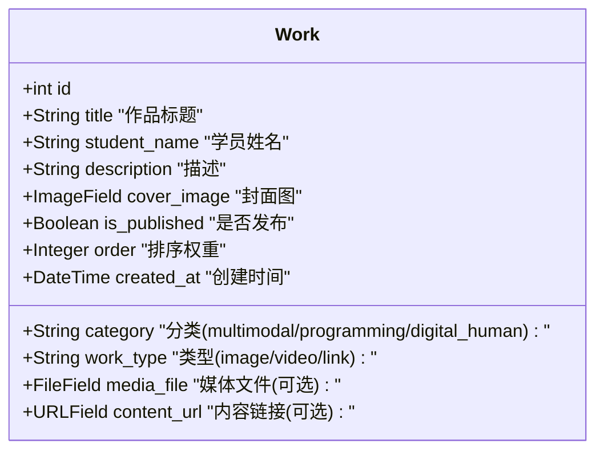

# 系统架构文档

## 1. 系统概览

Good Craft 是一个基于 Django 框架构建的 Web 应用程序，旨在展示学员的 AI 创作作品。系统采用经典的 MVT (Model-View-Template) 架构模式，使用 SQLite 作为默认数据库，适合轻量级部署和快速开发。

### 核心技术栈

- **后端框架**: Django 5.1.4 (Python Web 框架)
- **数据库**: SQLite (默认), 可迁移至 PostgreSQL/MySQL
- **前端技术**: 原生 HTML5, CSS3, JavaScript (无重型前端框架依赖)
- **图片处理**: Pillow (用于处理上传的封面和图片)

## 2. 架构设计

```mermaid
graph TD
    User[用户/浏览器] --> Nginx[Web服务器 (Nginx/Apache)]
    Nginx --> Gunicorn[WSGI应用服务器]
    Gunicorn --> Django[Django 应用核心]
    
    subgraph "Django Application"
        URL[URL 路由分发] --> View[View 视图逻辑]
        View --> Model[Model 数据模型]
        View --> Template[Template 模板引擎]
        Model <--> DB[(SQLite 数据库)]
    end
    
    User -.-> Static[静态文件 (CSS/JS)]
    User -.-> Media[媒体资源 (图片/视频)]
```

> [!NOTE]
> 在开发环境中，`runserver` 同时充当 Web 服务器和应用服务器的角色。生产环境中建议使用 Nginx + Gunicorn/uWSGI 的组合。

## 3. 模块设计

### 目录结构

系统主要由以下模块组成：

- `config/`: 项目的核心配置目录，包含 `settings.py` (全局配置), `urls.py` (根路由), `wsgi.py` (WSGI 入口)。
- `showcase/`: 核心应用 app，负责作品展示的业务逻辑。
- `media/`: 存储用户上传的动态媒体文件（作品封面、视频等）。
- `docs/`: 项目文档目录。

### Showcase 应用架构

`showcase` 应用遵循 Django 的标准结构：

- **Models (`models.py`)**: 定义数据结构。
- **Views (`views.py`)**: 处理 HTTP 请求，查询数据并渲染模板。
- **Admin (`admin.py`)**: 定制 Django 后台管理界面。
- **Templates (`templates/`)**: 存放 HTML 页面模板。
- **Static (`static/`)**: 存放应用特有的静态资源。

## 4. 数据模型设计

核心实体为 `Work` (学员作品)。



### 字段说明

- **Category (分类)**: 用于在首页进行标签页分组展示。
- **Work Type (类型)**: 决定了作品详情的展示方式（是显示图片、播放视频还是跳转链接）。
- **Media File vs Content URL**: 
    - `media_file` 用于存储本地上传的资源（如视频文件、高清大图）。
    - `content_url` 用于指向外部资源（如 GitHub 仓库地址、在线演示地址）。

## 5. 安全性设计

- **CSRF 保护**: Django 内置的 CSRF 中间件保护所有 POST 请求。
- **输入验证**:通过 Django Forms 和 Model 验证机制确保数据完整性。
- **XSS 防护**: 模板引擎默认对变量输出进行转义，防止跨站脚本攻击。
- **静态资源分离**: 生产环境中静态资源应由 Nginx 直接服务，不经过 Django 处理。
